# AgriTrust Platform - XRPL Architectural Diagram

This document provides a textual architectural overview of how the XRP Ledger (XRPL) is integrated and utilized within the AgriTrust platform.

```mermaid
graph TD
    subgraph "User Layer (Frontend/Wallets)"
        U_Farmer["Farmer via dApp Frontend"]
        U_Investor["Investor via dApp Frontend"]
        U_Admin["Admin via Admin Portal"]
        WalletConnect["WalletConnect Integration"]
    end

    subgraph "Application Layer (Next.js Backend)"
        API_Routes["Next.js API Routes"]
        XRPL_Services["XRPL Services Lib (xrpl.js)"]
        IPFS_Service["IPFS Service"]
        DB_Cache["SQLite Cache (lib/db.ts)"]
    end

    subgraph "XRP Ledger (XRPL)"
        XRPL_Network["XRPL Network (Mainnet/Testnet/Devnet)"]
        XRPL_Accounts["User Accounts (Farmer, Investor, Admin)"]
        XRPL_NFTs["Project NFTs (NFTokenMint)"]
        XRPL_Memos["Transaction Memos (for metadata)"]
        XRPL_Payments["RLUSD Payments (IOU)"]
        XRPL_Hooks["XRPL Hooks (Smart Contracts)"]
        XRPL_Fees["XRP (for Transaction Fees)"]
    end

    subgraph "External Services"
        IPFS_Network["IPFS Network (for Document Storage)"]
    end

    %% User Interactions with Application Layer
    U_Farmer -->|"1. Create Project (Data)"| API_Routes
    U_Investor -->|"3. Invest in Project (RLUSD)"| API_Routes
    U_Farmer -->|"5. Post Project Update (Data)"| API_Routes
    U_Farmer -->|"6. Submit Settlement Proof (Doc Hash)"| API_Routes
    U_Admin -->|"7. Verify Settlement"| API_Routes
    U_Admin -->|"8. Trigger Profit Distribution"| API_Routes
    U_Farmer & U_Investor & U_Admin -->|"Sign Transactions via WalletConnect"| WalletConnect

    %% Application Layer Interactions with XRPL
    API_Routes -->|"Uses"| XRPL_Services
    XRPL_Services -->|"2a. Mint Project NFT (URI w/ core data)"| XRPL_NFTs
    XRPL_Services -->|"2b. Store Extended Data (Self-Payment w/ Memo)"| XRPL_Memos
    XRPL_Services -->|"4a. Facilitate RLUSD Payment (Investor to Farmer)"| XRPL_Payments
    XRPL_Services -->|"4b. Record Investment (Memo on Payment)"| XRPL_Memos
    XRPL_Services -->|"5a. Store Update (Self-Payment w/ Memo)"| XRPL_Memos
    XRPL_Services -->|"6a. Store Settlement Proof Hash (Memo)"| XRPL_Memos
    XRPL_Services -->|"7a. Notarize Settlement (Admin Memo)"| XRPL_Memos
    XRPL_Services -->|"8a. Distribute Profits (RLUSD Payments)"| XRPL_Payments
    XRPL_Services -->|"Deploy/Interact"| XRPL_Hooks
    XRPL_Services -->|"All Tx use XRP for Fees"| XRPL_Fees
    XRPL_Services -->|"Read Account/Ledger Data"| XRPL_Network
    XRPL_Services -->|"Manages"| XRPL_Accounts

    %% Application Layer Interactions with Other Services
    API_Routes -->|"Cache Data"| DB_Cache
    API_Routes -->|"Read Cached Data"| DB_Cache
    API_Routes -->|"Store/Retrieve Docs"| IPFS_Service
    IPFS_Service -->|"Store/Retrieve"| IPFS_Network

    %% XRPL Hooks Interactions (Conceptual - Hooks are on accounts)
    XRPL_Payments -- "Incoming Investment" --> XRPL_Hooks["Investment Validation Hook (on Farmer's Project Account)"]
    XRPL_Payments -- "Incoming Admin Tx for Stage/Settlement Auth" --> XRPL_Hooks
    XRPL_Payments -- "Outgoing Payouts" --> XRPL_Hooks["Settlement Distribution Validation Hook (on Farmer's Project Account)"]

    %% WalletConnect Flow
    WalletConnect -->|"Provides Signed Tx"| API_Routes

    classDef user fill:#c9ffc9,stroke:#333,stroke-width:2px;
    classDef app fill:#lightblue,stroke:#333,stroke-width:2px;
    classDef xrpl fill:#ffebcc,stroke:#333,stroke-width:2px;
    classDef external fill:#e6e6fa,stroke:#333,stroke-width:2px;

    class U_Farmer,U_Investor,U_Admin,WalletConnect user;
    class API_Routes,XRPL_Services,IPFS_Service,DB_Cache app;
    class XRPL_Network,XRPL_Accounts,XRPL_NFTs,XRPL_Memos,XRPL_Payments,XRPL_Hooks,XRPL_Fees xrpl;
    class IPFS_Network external;
```

## Key XRPL Utilization Points:

1.  **User Identity & Accounts:**
    *   Farmers, Investors, and Admins each have XRPL accounts.
    *   These accounts are used for sending/receiving payments and signing transactions.
    *   User profile metadata (type, name, etc.) can be associated with accounts using the `Domain` field or by linking to data stored in Memos (as per `plan.MD`).

2.  **Project Creation & Representation:**
    *   **NFTs (`NFTokenMint`):** Each agricultural project is represented as an NFT on the XRPL.
        *   The `URI` field of the NFT stores core, concise project details (title, category, location, funding goal, duration, ROI, stage) typically as a JSON string, hex-encoded.
        *   NFTs are minted by the farmer's account.
        *   The `NFTokenTaxon` field is used to categorize these as agricultural project NFTs.
        *   Flags can be set (e.g., `tfTransferable` or not, to make them soulbound if desired).
    *   **Memos:** Extended project details (detailed budget, timeline, farmer experience) are stored in the `Memos` field of a separate transaction (often a tiny self-payment by the farmer) linked to the project NFT ID.

3.  **Investment Process:**
    *   **RLUSD Payments:** Investments are made using RLUSD (an IOU/token on the XRPL). Investors send RLUSD `Payment` transactions from their XRPL account to the farmer's project-designated XRPL account.
    *   **Memos for Investment Data:** The investment payment transaction includes a `Memo` field containing the `NFTokenID` of the project being funded, linking the payment to the specific project.
    *   **TrustLines:** Investors and farmers must have a TrustLine set for the RLUSD token from the correct issuer to hold and transact RLUSD.

4.  **Project Updates:**
    *   Farmers post updates by sending a minimal XRP `Payment` transaction (e.g., to themselves or a designated address) with the update content (message, current stage, timestamp) encoded in the `Memos` field. This creates an on-chain, auditable history of updates.

5.  **Settlement Process:**
    *   **Proof Storage (IPFS + XRPL):**
        *   Farmers upload proof-of-revenue documents (e.g., sales invoices) to IPFS.
        *   The IPFS CID (hash) of the document, along with other settlement details (project ID, revenue amount), is stored in the `Memos` field of an XRPL transaction submitted by the farmer.
    *   **Admin Verification (Notarization):**
        *   An Admin verifies the submitted proof.
        *   The Admin then submits another XRPL transaction (e.g., a self-payment with a Memo) that references the farmer's submission (or the project NFT ID) and includes verification details (admin signature/address, verification timestamp). This acts as an on-chain notarization.
    *   **Profit Distribution:**
        *   Once verified, profits (in RLUSD) are distributed via XRPL `Payment` transactions from the farmer's project account (or a designated platform/escrow account) to investors' XRPL accounts and the farmer.
        *   These payment transactions can also include `Memos` referencing the settlement record.

6.  **XRPL Hooks (Smart Contracts):**
    *   **Investment Validation Hook:** Deployed on the farmer's project funding account.
        *   Validates incoming RLUSD investment payments (correct currency/issuer, project stage is "funding", min/max investment amounts, funding cap).
        *   Updates on-chain state for `CurrentFundingRLUSD`.
    *   **Settlement Authorization & Distribution Validation Hook (Conceptual):** Deployed on the farmer's project account.
        *   Allows an admin-triggered transaction to authorize the distribution phase and record verified revenue.
        *   Can provide basic validation for outgoing payouts (e.g., not exceeding total verified revenue).
    *   **Project Stage Update Hook:** Deployed on the farmer's project account.
        *   Allows an admin-triggered transaction (with appropriate memo) to update the on-chain `ProjectStage` state variable.

7.  **Transaction Currency & Fees:**
    *   **RLUSD:** Primary currency for investments and profit distributions.
    *   **XRP:** Native currency of the XRPL, used to pay for all transaction fees (NFT mints, payments, memo transactions, hook deployments).

8.  **Data Management:**
    *   **XRPL as Source of Truth:** All critical project lifecycle events, ownership, investments, and settlements are anchored to the XRPL.
    *   **SQLite Cache:** A local SQLite database is used by the backend application to cache data queried from the XRPL (project details, investment lists, user profiles) for faster frontend loading and to reduce direct XRPL queries. The cache is populated/updated by listeners or polling mechanisms that observe XRPL transactions.

9.  **WalletConnect:**
    *   Used on the frontend to allow users (farmers, investors) to connect their existing XRPL wallets (e.g., Xumm, GemWallet) to the dApp.
    *   Facilitates secure signing of transactions (NFT mints, RLUSD payments, memo transactions) initiated by the dApp, without the dApp ever handling user private keys. The signed transaction blob is then sent to the backend API for submission to the XRPL.

This architecture leverages XRPL's strengths in asset issuance, fast/low-cost payments, NFT capabilities, and on-chain data storage (via Memos and Hook state) to create a transparent and auditable agricultural funding platform.